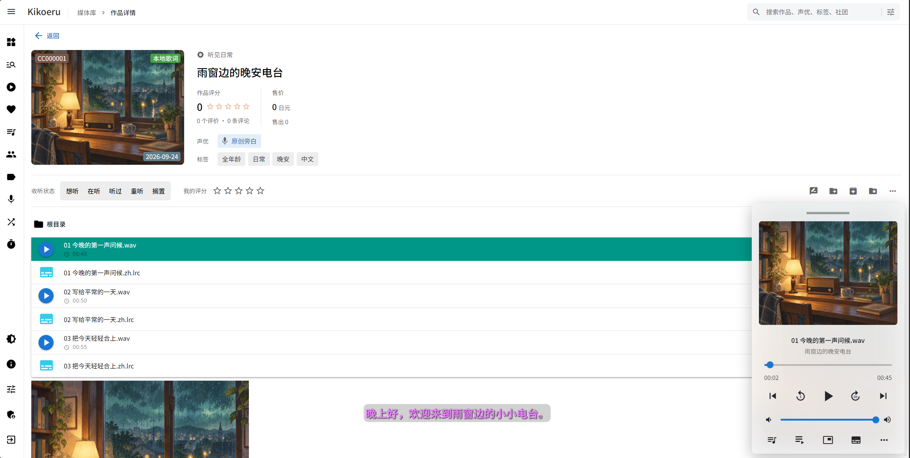
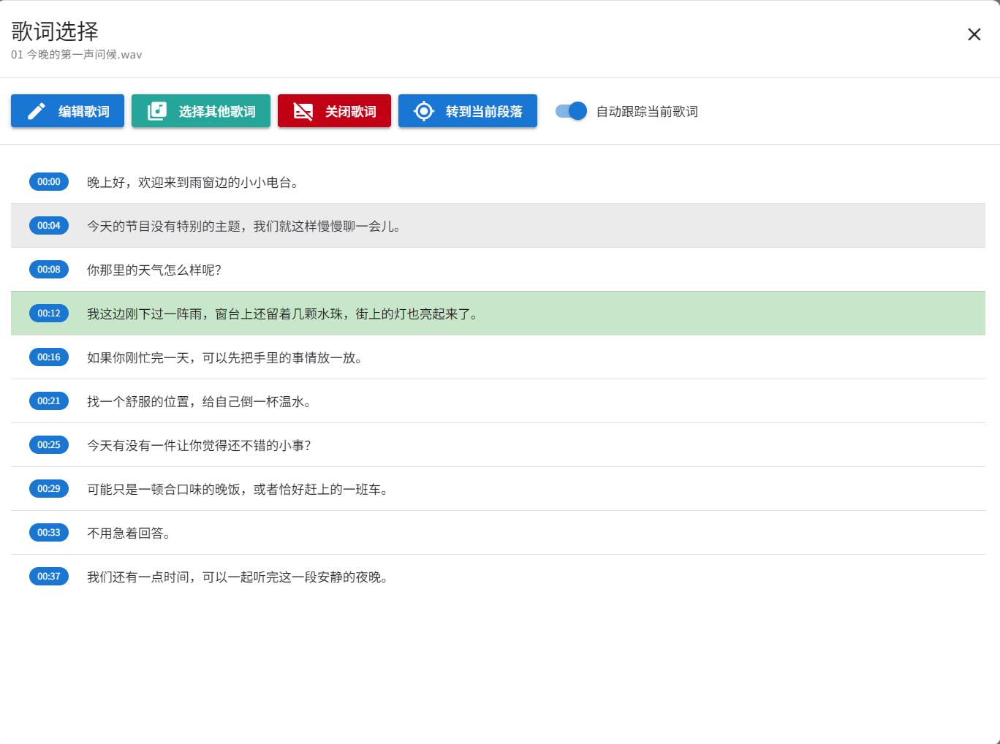
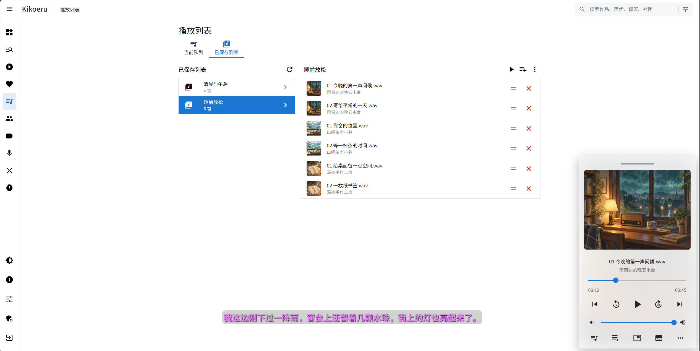
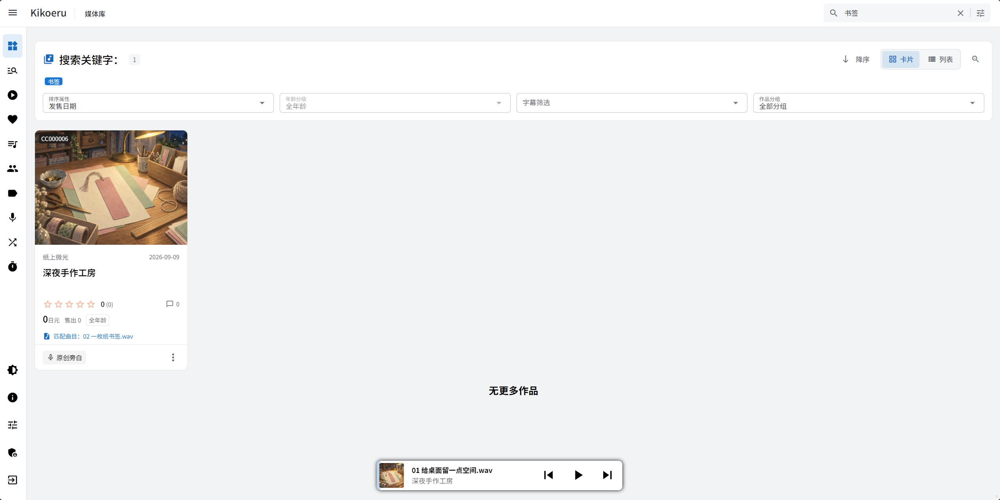

# Kikoeru

Kikoeru 是用于管理和播放本地 DLsite 音声作品的自托管媒体应用，你可以在电脑或 NAS 上保存音声，通过电脑和手机浏览器查找作品、播放曲目、查看字幕，并整理自己的收藏与收听进度

**[下载 Windows / Linux 便携版](https://github.com/ValoHalo/Kikoeru/releases/latest)** · [容器运行](#容器运行) · [构建与开发](BUILDING.md)


*截图中的作品为虚构示例，封面使用生成插画*

## 主要功能

- **音声库管理**：扫描本地作品，获取 DLsite 元数据与封面，支持自定义作品、作品分组和归档
- **搜索与筛选**：按作品名称、声优、标签、社团和曲目文件名搜索，支持年龄分级与字幕筛选
- **音频播放**：支持播放队列、已保存列表、倍速、循环、随机播放、睡眠定时和按需 AAC 转码
- **本地字幕**：按语言偏好自动选择字幕，支持手动切换、字幕定位和编辑
- **收藏与进度**：保存评分、评价、收听状态和播放记录，继续上次的播放进度
- **作品浏览**：提供卡片与列表视图，可浏览作品目录、图片和字幕文件
- **多端与多语言**：适配电脑和手机浏览器，支持简体中文、繁体中文、日语和英语
- **便携版更新**：在管理页面检查、下载并安装新版本

## 界面展示

<details>
<summary>查看作品与播放曲目</summary>

在同一页面查看作品资料、标签和文件目录，通过悬浮播放器控制当前曲目



</details>

<details>
<summary>查看字幕与定位播放位置</summary>

字幕面板显示每段内容的时间位置，并高亮当前段落，可以切换字幕、跳转播放位置或编辑字幕



</details>

<details>
<summary>保存和管理播放列表</summary>

把多个作品中的曲目整理到同一个列表，调整顺序后保存，下次可以直接播放



</details>

<details>
<summary>按曲目名称查找作品</summary>

搜索本地音频文件名时，结果会显示命中的曲目，方便找到只记得文件名称的内容



</details>

<details>
<summary>通过作品分组整理音声库</summary>

为作品建立自己的分组，再从音声库中筛选查看


</details>

<details>
<summary>手机浏览器界面</summary>

在手机布局下查看作品资料，使用迷你播放器控制播放，并显示当前字幕


</details>

## 快速开始

1. 从 [GitHub Releases](https://github.com/ValoHalo/Kikoeru/releases) 下载适合自己系统的便携版压缩包
2. 完整解压后，Windows 运行 `start-kikoeru.cmd`，Linux 运行 `start-kikoeru.sh`
3. 本机打开 `http://127.0.0.1:8888/`，其他设备打开 `http://<服务器 IP>:8888/`
4. 使用默认用户名 `admin`、默认密码 `admin` 登录
5. 根据首次初始化页面的指示完成配置
6. 进入管理设置中的音声库页面，点击页面下方的“扫描本地音声库”，完成首次扫描

## 关于音声库

建议选择一个固定的媒体目录保存音声，每部作品使用独立文件夹，DLsite 作品的文件夹名中应包含对应的 RJ、BJ 或 VJ 编号

下面只是目录示例，媒体目录可以自行选择，作品文件夹内的音频名称和子目录可以按自己的习惯整理

```text
E:\media\
├─ RJ01610397\
├─ RJ01355336 作品标题\
└─ 社团名\
   ├─ RJ01355336\
   └─ RJ01610397\
```

常见的 `mp3`、`flac`、`wav`、`m4a`、`aac`、`opus`、`ogg` 格式音频均可识别，部分作品中的 `mp4` 视频也可以在大图模式下播放画面

本地字幕支持 `lrc`、`vtt`、`srt`、`ass` 等格式

## 更新

Windows 和 Linux 便携版可以在“管理设置 / 更新”中检查、下载并安装最新的 GitHub Release，安装操作需要由管理员进行

容器部署通过拉取新镜像并重新创建容器完成更新，更新时保留原有的 `/data` 数据卷和媒体目录挂载

## 容器运行

容器镜像发布在 [ghcr.io](https://ghcr.io/valohalo/kikoeru)，Podman 示例

```bash
KIKOERU_PORT=8888
podman run -d --name kikoeru \
  -e PORT="$KIKOERU_PORT" \
  -p "$KIKOERU_PORT:$KIKOERU_PORT" \
  -v kikoeru-data:/data \
  -v /path/to/VoiceWork:/media \
  ghcr.io/valohalo/kikoeru:latest
```

`KIKOERU_PORT` 可按需修改，使用 Docker 时将命令中的 `podman` 替换为 `docker`

首次登录后，在初始化页面中把媒体目录配置为容器内的 `/media`

## 构建与反馈

- [构建与开发](BUILDING.md)：源码结构、本地开发、Windows / Linux 便携包和容器镜像构建
- [反馈问题](https://github.com/ValoHalo/Kikoeru/issues)：请说明使用版本、运行平台、复现步骤和相关错误信息

## 致谢

- [kikoeru-express](https://github.com/Number178/kikoeru-express) 及其 [Docker 镜像](https://hub.docker.com/r/number17/kikoeru)：上游后端，本项目基于 Docker 镜像中的代码进行修改
- [kikoeru-quasar](https://github.com/Number178/kikoeru-quasar)：上游前端，适配新版本后端后继续调整
- ASMR ONE：参考了部分交互和设置项
- ChatGPT / Codex

## 声明

本项目用于管理用户合法持有的本地音声资料，本身不提供音声资源

程序作者与使用本程序的内容提供商没有联系，不为其提供技术支持，也不为其侵权或其他不当使用承担法律责任

## 许可协议

源码采用 [GNU General Public License v3.0](https://github.com/ValoHalo/Kikoeru/blob/main/LICENSE)
